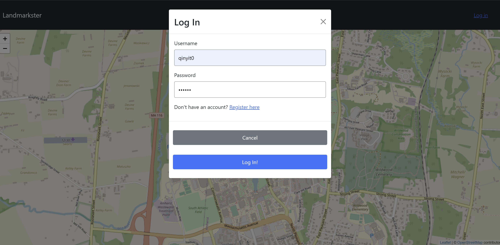
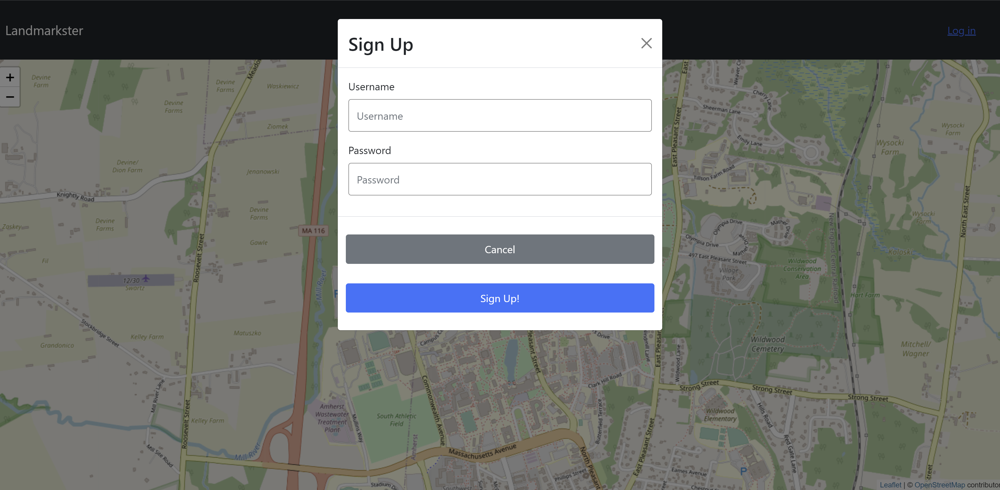
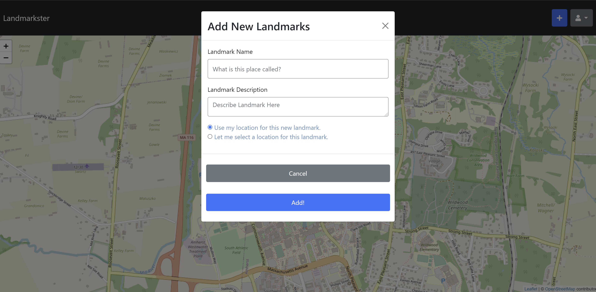
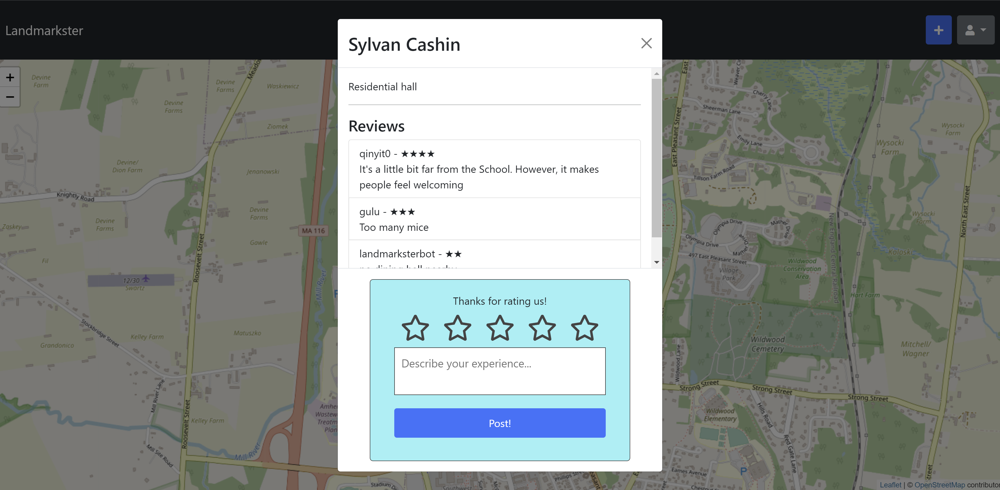
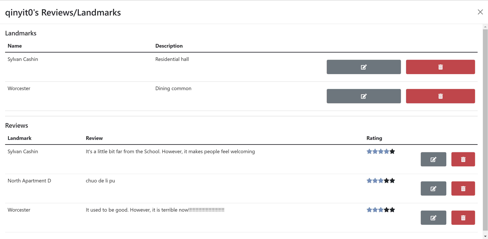
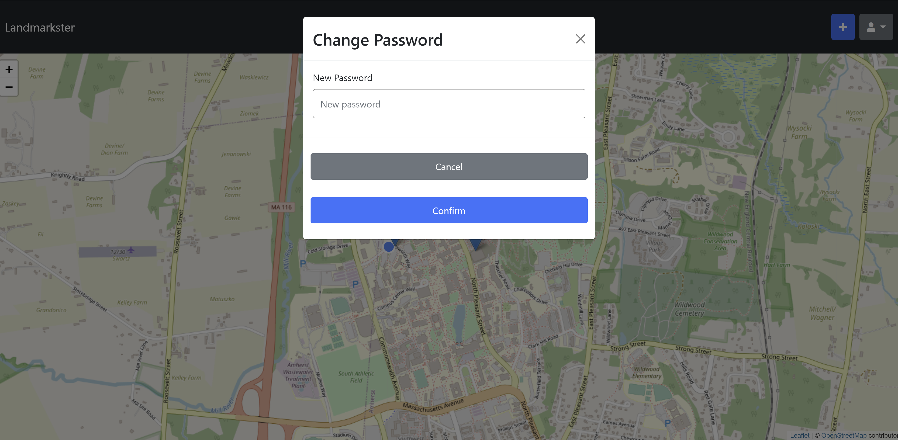

# Team-gamma

## Landmarkster - Fall 2021

---

#### Overview
This website allows users to share landmarks and various interesting sights in their
neighborhood, and view landmarks that have been shared by others. Users can add landmarks, reviews and delete their own landmarks, reviews. Users can also see other people's reviews from the website.
    
>The closest existing application to what we're trying to do is Google Niantic's
Field Trip.  But it was unwilling to accept contributions from users and shut
down in 2019: [Field Trip](https://nianticlabs.com/blog/fieldtrip/?hl=en)

>The closest approximation that still exists is Atlas Obscura. However, there are
higher standards for contributions and it is more focused on particularly
unusual things (that may not even be open for visitors to access) than on
general landmarks and interesting sights you can go see: [Atlas
Obscura](https://www.atlasobscura.com/)

---

#### Team members

|        |      Name     | GitHub Username |
|:------:| :-----------: |:---------------:|
|Member 1| Joshua Barret | jjbarr          |
|Member 2| Ruoyi Wu      | Ry-Wu           |
|Member 3| Qinyi Tang    | Qinyit0         |

---

#### User Interface

>Initial Page
>
>This is the original web page. It needs people to give it geographic authority.
>

>Log In Page
>
>When we click the log in button, it will show this. If we don't have an account
>we need to first sign up. After we create an account, we need to log in.
>

>Sign Up Page
>
>When we click the "Register here", it will show the sign up page. If the
>username we choose is already used by others, we should choose another
>username.  

>After Log In Page
>
>This is the web page after we logged in. On the search bar, we can see there
>are two buttons. One is add new landmarks, the other is user management. We can
>also find out that there are serval landmarks on the map.
>

>Add new landmarks
>
>The "+" button help us to add new landmarks on the map. We can either use our
>current location or select a location to add landmarks.
>

>View and Add Reviews Page
>
>We can click the landmarks on the map to see other people's reviews and add our
>own reviews.
>

>User Management Page
>
>When we click the user icon, we can see there are some commands to help us
>management our own account.
>

>My Reviews/Landmarks Page
>
>If we want to edit our landmarks and reviews we can click "My
>Reviews/Landmarks". Here we can edit or delete our own landmarks and reviews.
>

>Change Password Page
>
>If we want to change the password to make the account more secure, we can click
>"Change Password".
>

---

#### APIs

All endpoints expect JSON as input unless otherwise specified

| Endpoint                    | Method | Description                                                                                                                                                                                   |
|-----------------------------|--------|-----------------------------------------------------------------------------------------------------------------------------------------------------------------------------------------------|
| `/login`                    | POST   | Takes `username` and `password` fields. Tries to log the user in.                                                                                                                             |
| `/logout`                   | POST   | Takes no body. Logs out the user if they are logged in.                                                                                                                                       |
| `/signup`                   | POST   | Takes `username` and `password` fields. Attempts to create a user with that name and password.                                                                                                |
| `/create_landmark`          | POST   | Takes a GeoJSON (RFC7946) Feature of type Point with the properties `name` and `description`. Attempts to create a landmark with that name and description at that location if authorized.    |
| `/landmark/<id>`            | GET    | Returns a GeoJSON Feature of type Point with properties `name`, `description`, `id`, `creator`, and `reviews` (an array of reviews objects as returned by `/reviews/<id>`.                    |
| `/landmark/<id>`            | PATCH  | Tekes a GeoJSON Feature of type Point with one or more properties `name` and `description`, and tries to replace the name of description of the landmark with those if authorized as creator. |
| `/landmark/<id>`            | DELETE | Deletes the landmark if authorized as creating user.                                                                                                                                          |
| `/landmark/<id>/add_review` | POST   | Takes an object with the fields `body` and `stars`. `stars` must be a number between 1 and 5. Creates a review of the landmark with that body and star rating if authorized.                  |
| `/review/<id>`              | GET    | Returns a JSON object containing `creator`, `id`, `landmark`, `lname`, `stars`, and `body` properties.                                                                                        |
| `/review/<id>`              | PATCH  | Accepts a JSON object containing `stars` and `body` properties. Attempts to update the review with the new stars and body if authorized as creating user.                                     |
| `/review/<id>`              | DELETE | Attempts to delete the review if authorized as creating user.                                                                                                                                 |
| `/user/<id>`                | GET    | Returns a JSON object with the properties `id`, `reviews`, and `landmarks`, being the `id` and reviews and landmarks created by the user respectively.                                        |
| `/self`                     | GET    | Acts like `/user/<id>`, where `<id>` is the id of the currently logged in user.                                                                                                               |
| `/self`                     | PATCH  | Accepts an object containing a `password` field. Attempts to update the current user's password.                                                                                              |
| `/landmarks_in`             | GET    | Accepts `lat1`, `long1`, `lat2`, and `long2` as arguments in the query string. Returns an array of landmark objects in the rectangle defined by the pair of latitudes and longitudes.         |
| `/logged_in`                | GET    | Returns an object with a single field, `result`, which is true if the user is logged in.                                                                                                      |

---

#### Database

##### landmarks table
| Column      | Data Type | Description                               |
|-------------|-----------|-------------------------------------------|
| id          | integer   | The id of the landmark                    |
| lat         | double    | The latitude of the landmark's location.  |
| long        | double    | The longitude of the landmark's location. |
| lname       | varchar   | The name of the landmark                  |
| description | varchar   | The review of the landmark                |
| creator     | varchar   | The creator of the landmark               |

##### reviews table
| Column       | Data Type  | Description                        |
|--------------|------------|------------------------------------|
| id           | integer    | The id of the review               |
| creator      | varchar    | The creator of the review          |
| landmark     | varchar    | The name of the landmark           |
| stars        | integer    | The number of stars of user rating |
| body         | varchar    | The content of the review          |

##### users table
| Column   | Data Type | Description                     |
|----------|-----------|---------------------------------|
| username | varchar   | The name of the user            |
| password | varchar   | The hashed password of the user |
| salt     | varchar   | The random salt of the password |

---

#### URL Routes/Mappings

| URL Routes | Description                                                                                    |
|:----------:|:----------------------------------------------------------------------------------------------:|
| /          | Our website only has one page, login/signup, see reviews, and change password are all pop-ups. |

---

#### Authentication/Authorization

| Name            | Description                          | Special Permissions                                                                                |
|:---------------:|:------------------------------------:|:--------------------------------------------------------------------------------------------------:|
| Log In          | switch to the log in pop up          | only the right password and email can be signed in. If is not accessible : pop up alret            |
| Sign Up         | switch to the sign up pop up         | the username which have signed before can not be signed again. If is not accessible : pop up alert |
| Change Password | switch to the change password pop up | after signed in, the user can change its password.                                                 |
| Add Landarks | switch to the add landmarks pop up | after signed in, the user can add new landmarks.                                                 |
| Delete Landmarks | switch to the My Reviews/Landmarks pop up | after signed in, the user can delete the landmarks himself/herself created.                                                 |
| Add reviews | switch to the change password pop up | after signed in, the user can add new reviews.                                                 |
| Delete Reviews | switch to the change password pop up | after signed in, the user can the user can delete the reviews himself/herself created.                                                 |

---

#### Division of Labor

##### Ruoyi Wu 
(Email: ruoyiwu@umass.edu, Github: Ry-Wu)
1. Innovated website ideas including main functionalities and uniquesness from other websites existed.
2. Documents(.md) writing and markdown design.
3. Coding(HTMl&CSS) Navigation bar and search bar in the main page, and design user info, log in, sign up page.
4. Coding(Javascript) Back-end API endpints Design Implementtion and database structure design.
5. Database Structure Design and Construction.
6. Font-end Interation/ Design with the back-end endpoints.
7. User signup/login and password storage with encryption.

##### Joshua Barrett 
(Emails: jjbarrett@umass.edu, jbarrett186@gmail.com; github:jjbarr)
1. Innovated website ideas including main functionalities and uniquesness from other websites existed.
2. Documents(.md) writing and markdown design.
3. Coding(HTMl&CSS) Website main(index) page and User Info page. Adding new landmarks on the map.
4. Coding(Javascript) Affects in main(index) page. Back-end API endpints Design Implementtion and database structure design. Font-end Interaction with the back-end server side.
5. Heroku Deployment/ Github.
6. Database Structure Design and Construction.
7. Font-end Interation/ Design with  the back-end endpoints.

##### Qinyi Tang
(Email: qinyitang@umass.edu, Github: Qinyit0)
1. Innovated website ideas including main functionalities and uniquesness from other websites existed.
2. Documents(.md) writing and markdown design.
3. Coding(HTMl&CSS) Navigation bar and search bar in the main page. User Interface update for better user experience
4. Coding(Javascript) Font-end Interaction with the back-end.
5. Font-end stars rating HTML can be used for back-end response.
6. Database Structure Design
7. Font-end Interation/ Design with the back-end endpoints

---

#### Rubric

##### General (\_/30 points) 
- Authentication
  - Successfully create a user
  - Successfully login as a user
  - Correctly store passwords as something other than plaintext
  - Allow the viewing of a user page and the editing/deletion of
    reviews/landmarks if you are logged in as that user
- Routing
- Linting/code style
- Heroku Deployment
- Video

##### Map Screen (\_/30 points)
- Successfully show user's location on the map
- Successfully display all landmarks near the user
- Successfully allow user to see landmark details by clicking or tapping an
  landmark on the display
- Successfully permit logged-in users and only logged-in users to add a landmark
  - Allow the use of the user's location or the selection of an arbitrary
    location for the new landmark.
- Permit logged in users to view their own user page
- Permit logged in users to change their password

##### User Page (\_/15 points)
- Successfully display all landmarks and reviews a user has created
- Allow users to edit their landmarks and reviews
- Allow users to delete thier landmarks and reviews

##### Landmark Pages (\_/15 points)
- Display the landmark's name and description to the user
- Display user reviews to the user.
- Allow logged-in users to leave a review
  - Provide an appropriate error message if a user who is not logged in attempts
    to leave a reivew
  - Provide an appropriate error message if a user who has already left a review
    attempts to leave a second one

##### CRUD (\_/10 points)
- Create
  - Users
  - Landmarks
  - Reviews
- Read
  - View nearby landmarks
  - View landmark reviews
  - View own reviews of landmarks
  - View own landmarks
- Update
  - Edit own reviews
  - Edit own landmarks
- Delete
  - Delete own reviews
  - Delete own landmarks

---

#### Heroku
[Landmarkster](https://landmarkster-gamma.herokuapp.com/)

#### Conclusion
