# Milestone 1: Project Wireframes 

###  Team Name

*Team_gamma*

### Application Name

**Landmarkster**

### Team Overview

|        |      Name     | GitHub Username |
|:------:| :-----------: |:---------------:|
|Member 1| Joshua Barret | jjbarr          |
|Member 2| Ruoyi Wu      | Ry-Wu           |
|Member 3| Qinyi Tang    | Qinyit0         |

### Innovative Idea
We want to build a website that acts as a "virtual tour guide". It allows users
to share landmarks and various interesting sights in their neighborhood, and
view landmarks that have been shared by others.  If visitors to our site think
there is one or more places worth visiting nearby, the website can show the
easiest way to get there.
    
The closest existing application to what we're trying to do is Google Niantic's
Field Trip.  But it was unwilling to accept contributions from users and shut
down in 2019: [Field Trip](https://nianticlabs.com/blog/fieldtrip/?hl=en) 

> Field Trip was a location based mobile app developed by Niantic 
>Labs for the Google Glass, Android, and iOS devices first released 
>in September 2012. The application utilized user location and various 
>databases in order to provide information and recommendations about 
>various points of interest in their surroundings.

The closest approximation that still exists is Atlas Obscura. However, there are
higher standards for contributions and it is more focused on particularly
unusual things (that may not even be open for visitors to access) than on
general landmarks and interesting sights you can go see: [Atlas
Obscura](https://www.atlasobscura.com/)

>Atlas Obscura is an American-based online magazine and travel company.
>It was founded in 2009 by author Joshua Foer and documentary filmmaker/author 
>Dylan Thuras. It catalogs unusual and obscure travel destinations via 
>user-generated content. The articles on the website cover a number of topics
>including history, science, food, and obscure places.

### Important Components

We will need to store the actual landmark location, name, text description,
image of the landmark. For this, we'll obviously need a database. While any
database is usable ([Postgres](https://www.postgresql.org/),
[SQLite](https://www.sqlite.org/index.html), etc). While a spatial database
extension like [SpatiaLite](https://www.gaia-gis.it/fossil/libspatialite/index)
[PostGIS](https://www.postgis.net) might be helpful, the constraint of deploying
on Heroku means we'll likely need to use off-the-shelf Postgres, which is not
ideal but is definitely workable. On the front-end, we'll need to get the user's
location in order to suggest local landmarks to them and for them to add local
landmarks. Fortunately, there are widely-implemented web APIs for doing exactly
this. We'll also need to display a map and provide directions. To this end, we
can utilize the [Google Maps API](https://developers.google.com/maps) or
[LeafletJS](https://leafletjs.com) and the associated plugins that provide the
functionality we'll need. As for our frontend interface itself,
[Bootstrap](https://getbootstrap.com/) is recommened and nothing else is
permitted. The backend server that will actually provide pages and service
requests will be written in [node](https://nodejs.org/en/) (as is required), and
provide a REST API allowing the frontend to request information from the
database and add new landmarks if the user requests (provided, of course, that
the user is signed in).

### Wireframes

##### ***Initial_view***
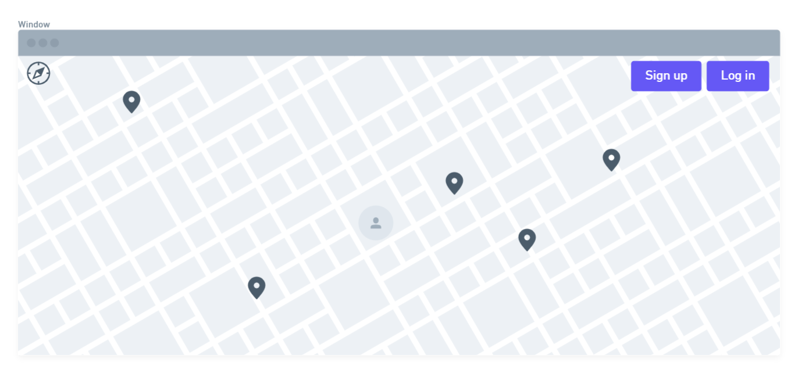
The location marks represent landmarks. The user icon identifies the position of the user.

#### ***Sign_up***
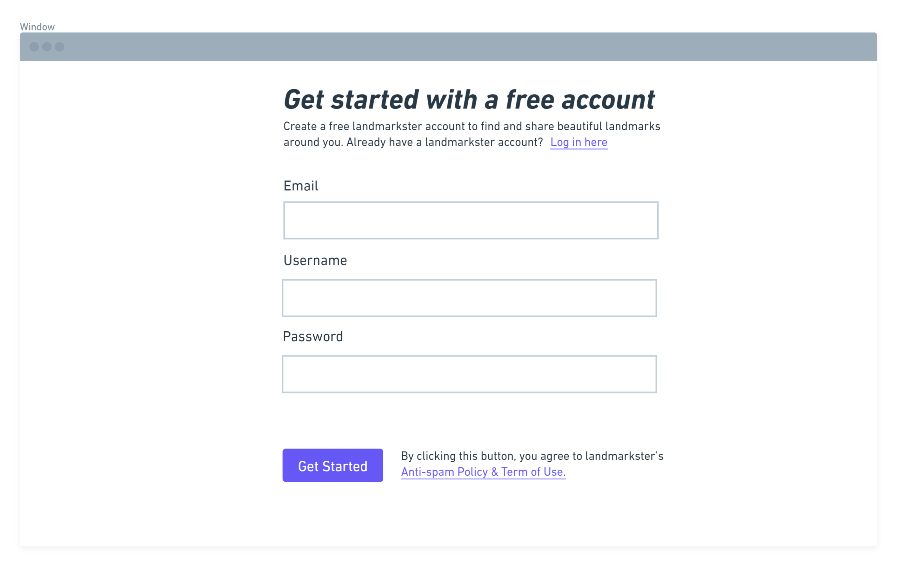
To use this website, you need to create an account.

#### ***Log_in***
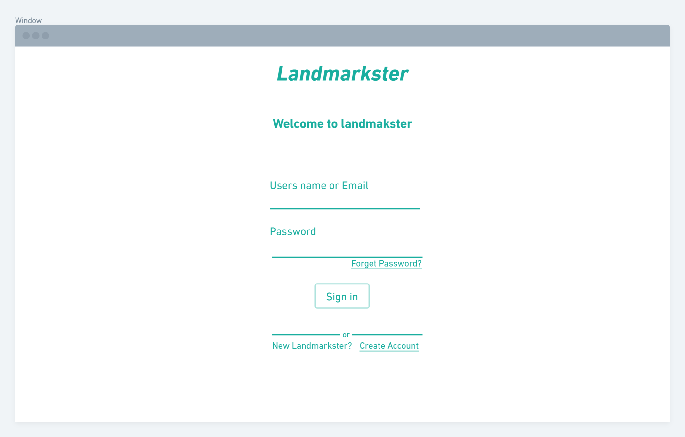
After create an account, log in to the webpage.

#### ***After_login***
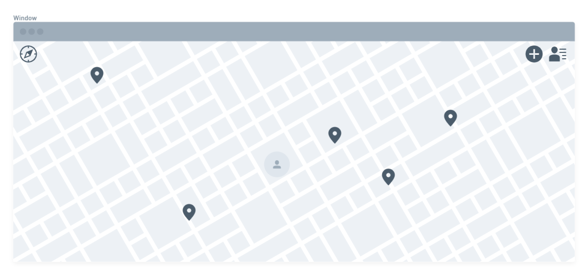
After a user signs up/logs in, the log in/sign up button is replaced by the "add landmark" button and a user avatar.

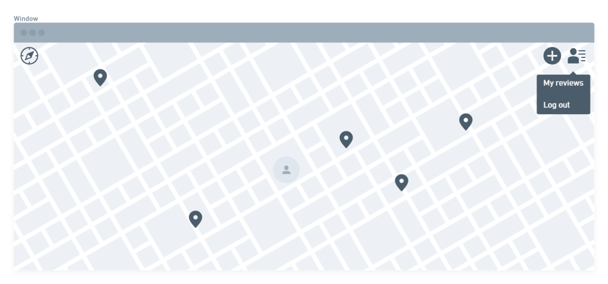
When clicking the user avatar, a user can see its past landmark reviews or log out.

#### ***Remove_Past_Review***
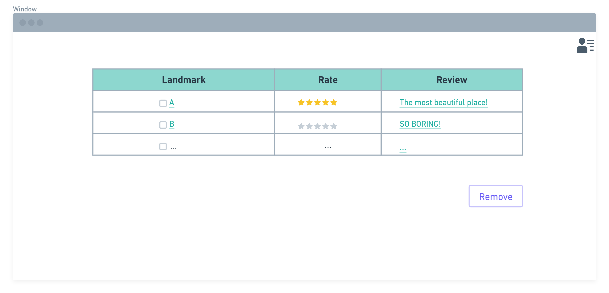
When click my reviews, a page will show like the image above. The users can delete any reviews that theirselves posted.

#### ***Find_and_Review***
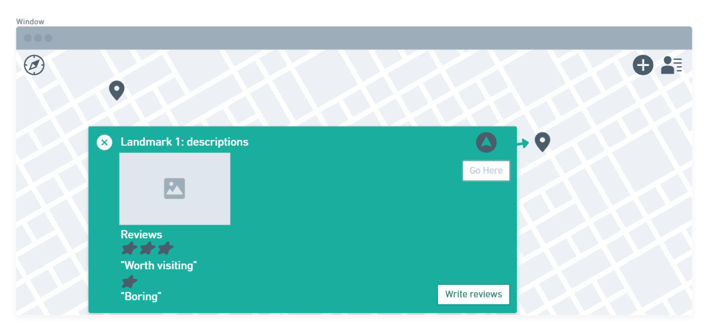
The user can click on the landmarks to see descriptions and images of that landmark, other people's reviews/comments, and a button that shows the direction to go there. A user may write reviews for the selected landmark by clicking the "Write reivew" button. The descriptions and comments of a landmark can be closed by clicking the "x" circle on the left side of the green bar.

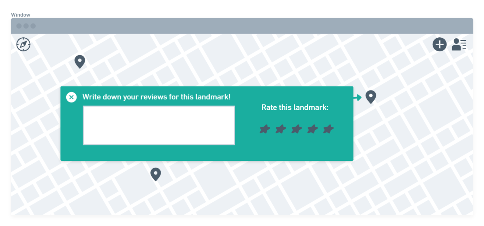
Once clicking the "Write reviews" button, the user is able to write its own reviews and give a rating.

#### ***Share_landmarks***
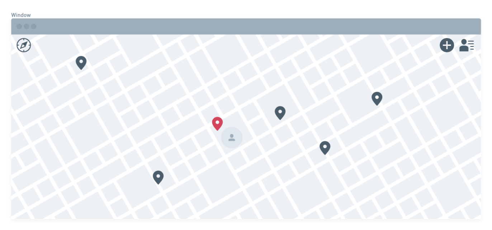
The user can also add landmarks and comments on the map by clicking the "add" button on the top left corner. The red landmark below represents an added landmark.

### HTML Pages
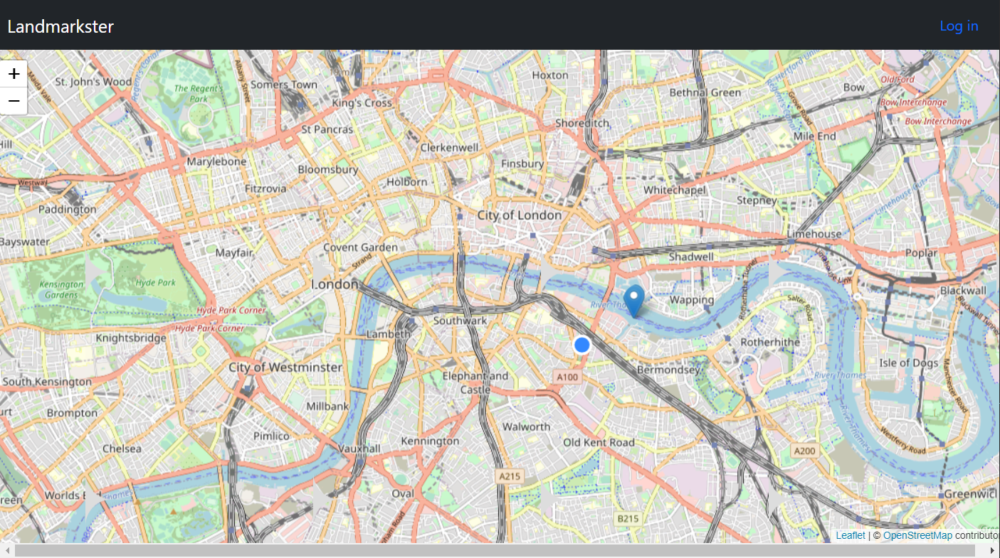
The homepage of our project includes a map with a location of the user, landmark signs, and a login button.

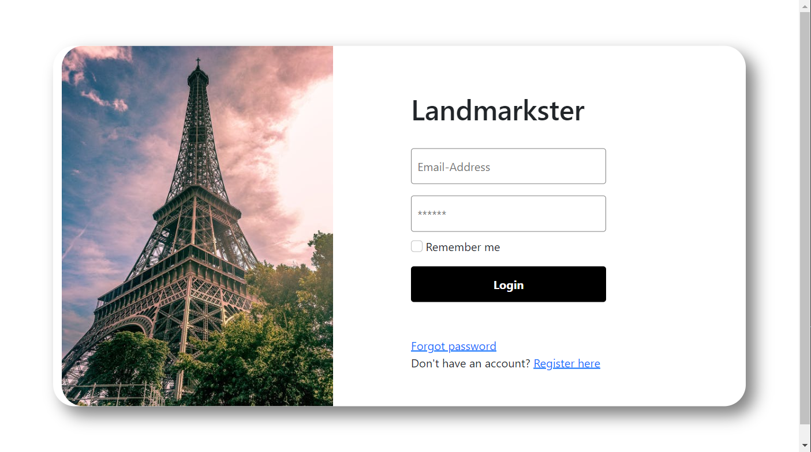
The login page allows users to enter username or email address with their password to login.

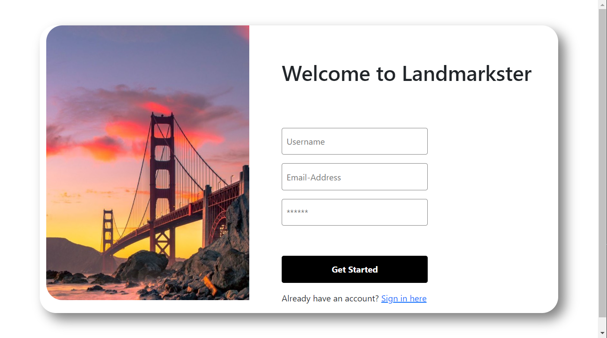
If the user does not have an account already, they can click on the "register here" and come to the sign up page.

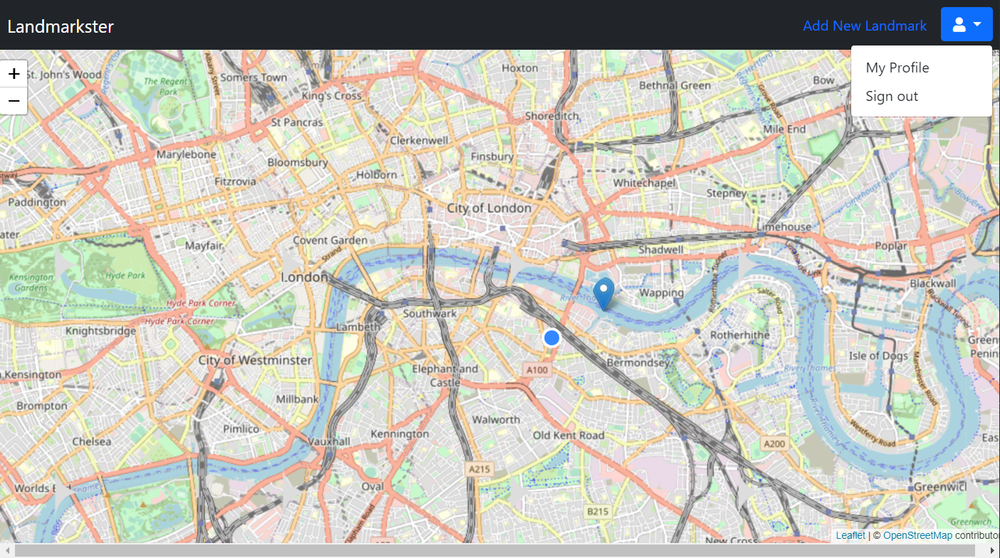
Once logged in, the user can click on the user avatar to choose to see their reviews or sign out, or add landmarks.

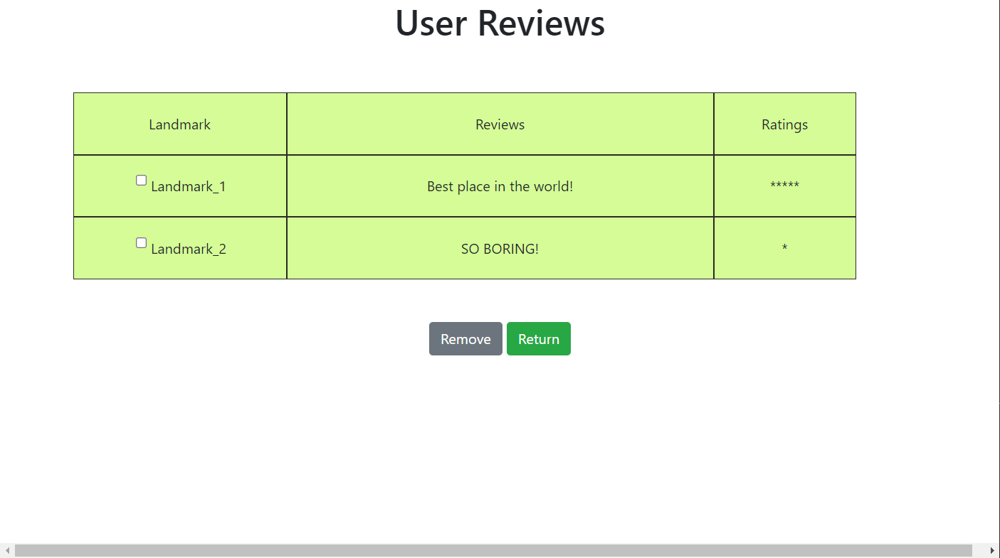
Users are able to see their previous reviews on certain landmarks, remove reviews, or return to the homepage.

### Division of labor
#### Ruoyi Wu 
(Email: ruoyiwu@umass.edu, Github: Ry-Wu)
1. implemented initial sign-up/login page
2. created and revised user review page
3. added links between different HTML pages

#### Joshua Barrett 
(Emails: jjbarrett@umass.edu, jbarrett186@gmail.com; github:jjbarr)
1. Did the map layout on the main page
2. Integration work (cleanup, analysis, etc)
3. Drew up the mainpage topbar
