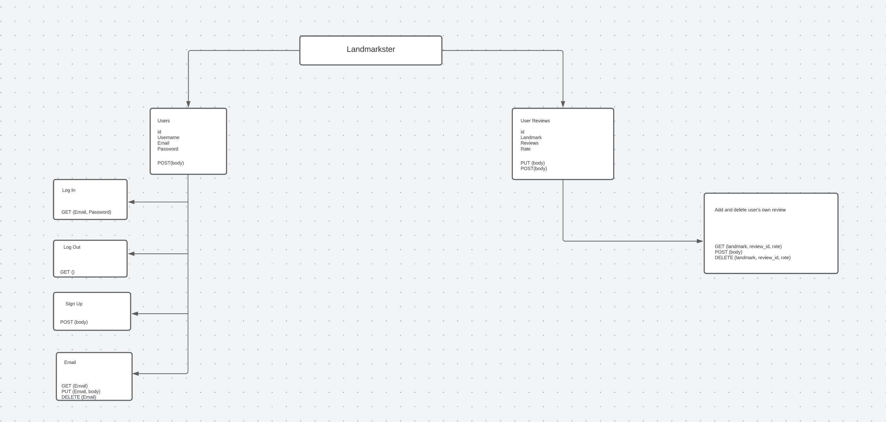
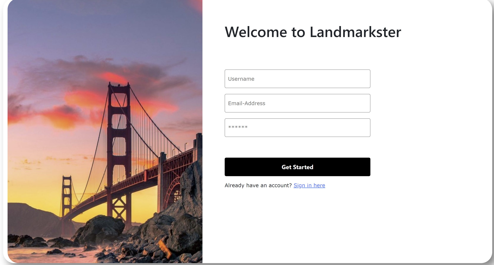
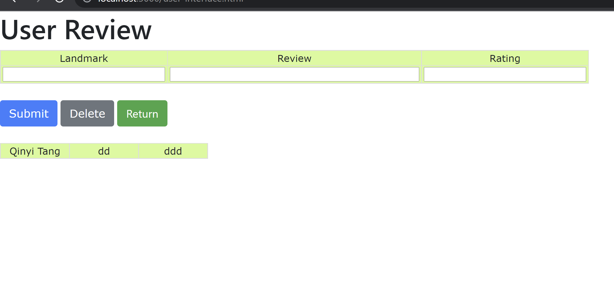
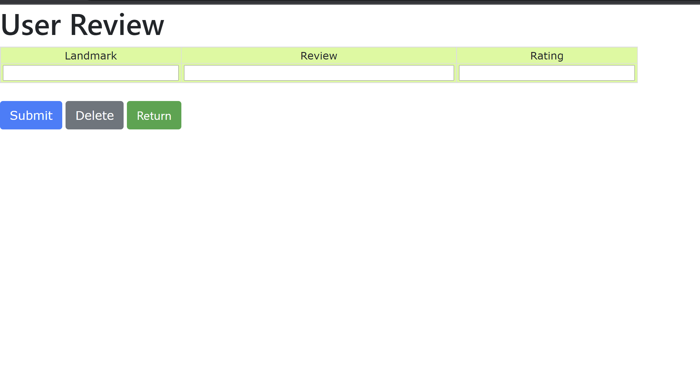

# 1. API Specification
The server shall implement the following API endpoints. Some of them are
presently under-specifed because we still need to figure out the spec.
- `/login`: A `POST` endpoint. Uses provided credentials to authorize the
  user. The `/login` endpoint shall, upon successful authentication return to
  the user an authorization token.
- `/logout`: A `POST` endpoint. Shall revoke the user's authorization token, if
  the token is valid. Shall otherwise perform no action.
- `/signup`: A `POST` endpoint. Shall create a new user with the credentials
  specified upon success, or indicate failure.
- `/create_landmark`: A `POST` endpoint. Shall create a new landmark based upon
  data received in a JSON object. The object shall be a RFC7946 GeoJSON Feature
  object with geometry of type Point which contains the properties `name` and
  `description`.
- `/landmark/<id>`: This endpoint has multiple methods, and the semantics of
    each shall be described:
  - As a `GET` endpoint. If a landmark with the given ID exists, this endpoint
    shall return a GeoJSON Feature with geometry of type Point and the
    properties `name` (string), `description` (string), `id` (number), `creator`
    (string), and `reviews` (array of objects with the properties `creator`
    (string), `id` (number), `stars` (number), `landmark` (number), `lname`
    (string), and `body` (string)). It is undefined as to whether the `reviews`
    property contains all reviews for a landmark. If there is some time at which
    this is not the case, there will be a method provided for obtaining more
    reviews than are listed.
  - As a `PATCH` endpoint, this endpoint requires authorization that corresponds
    to the original creating user. It shall accept the same set of properties as
    the `/create_landmark` endpoint, with the exception of the fact that any
    property may be null, so long as a single property is present (presently is
    only the `name` and `description` properties are valid here). If the
    property is null, it shall not be changed. Otherwise, all properties of the
    landmark shall be updated to those provided in the request.
  - As a `DELETE` endpoint, this endpoint shall accept an object containing
    solely `authorization`. If that authorization corresponds to the creating
    user, the landmark shall be deleted.
- `/landmark/<id>/add_review`: A `POST` endpoint. This endpoint shall accept a
  JSON object containing an `body` field (string), and a `stars` field
  (number). The `stars` field shall contain an integer number between 1
  and 5. The `body` field may contain arbitrary text.
- `/review/<id>`: This is endpoint has multiple methods.
  - As a `GET` endpoint, this returns the review specified. The review is a JSON
    object that shall contain the `creator`, `id`, `landmark`, `lname`, `stars`,
    and `body` fields as specified in the format of `/landmark/<id>`.
  - As a `PATCH` endpoint, this receives an object in the same format
    `/landmark/<id>/add_review` does. Unlike with requests to
    `/landmark/<id>/add_review`, fields in `review` may be missing. This request
    shall, if the authorization token is valid and matches the creating user,
    update the review on the server such that fields that are present in
    `review` match their contents in `review`.
  - As a `DELETE` endpoint, this endpoint shall accept an object containing an
    `authorization` field. If the token is valid and matches the creating user,
    this review shall be deleted.
- `/user/<id>`: `GET` endpoint. If `<id>` is a valid username, this endpoint
  shall return a JSON object containing the fields `id` (string), `reviews`
  (array of `review` objects), and `landmarks` (array of `landmark` objects).
  - `/self`: `GET` endpoint. Is equivalent to `/user/<id>` for the current user.
- `/landmarks_in`: `GET` endpoint. Accepts two urlencoded coordinates in the
  parameters `lat1`, `long1`, `lat2`, `long2`, which define a rectangle. Shall
  return a JSON arry of `landmark` objects that are containted within the bounds
  of this rectangle.

The API flow diagram looks like the picture above.

# 2. screenshots of the client interface

### This API is used to create a new User and a User Registration in a single request. If we have a main website that User’s create their account on initially. The User is technically creating their global User object and a User Registration for that website (i.e. that Application). We want to create the User and the User Registration in a single step. 

### The Login Service API provides endpoints to manage the User Session in Conversational Cloud. Use this API to log into Conversational Cloud as a user with credentials or an application with an API key.
### The user reviews API provides following functionalities:

##### 1. Add comments

##### 2. Delete comments
### The log out API deletes the token information on the server side and clears any type of authentication for the logged in user.

# 3. Heroku Application

# 4. Breakdown of the division of labor 
#### Ruoyi Wu 
(Email: ruoyiwu@umass.edu, Github: Ry-Wu)
1. Finishing the Sign up and log in server
2. Changing the User reviews html.
3. Implementing the add and delete review API.

#### Joshua Barrett 
(Emails: jjbarrett@umass.edu, jbarrett186@gmail.com; github:jjbarr)
1. Doing the back-end skeleton code
2. Finishing API Planning
3. Changing some express problem

#### Qinyi Tang
(Email: qinyitang@umass.edu, Github: Qinyit0)
1. Drawing the API flow diagram.
2. Change the delete API.
3. Change some update API.
